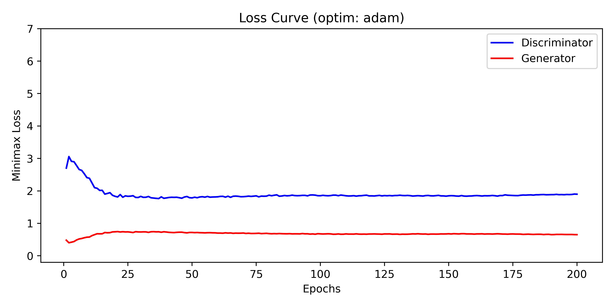
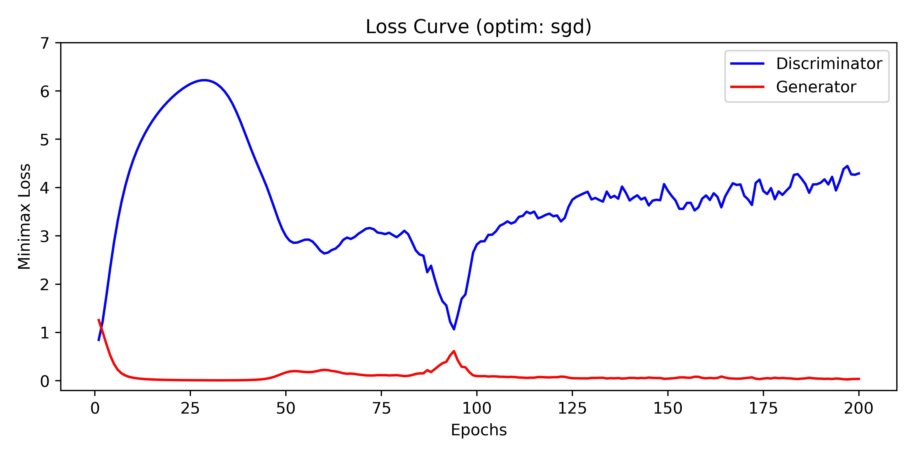

# Generative Adversarial Networks (GAN)
* Reproduction of <b><i><a href="https://arxiv.org/abs/1406.2661">\<Generative Adversarial Networks\></a></i></b> with PyTorch

# Settings
```
conda create -n gan python=3.12
conda activate gan
pip install -r requirements.txt

# Train
python train.py --config=gan.mnist.adam

# Generate
python subtasks/01_generate/exec.py -o adam
python subtasks/03_grid_generate/exec.py -o adam
```
# Results
<table align="center">
  <tr>
    <td align="center">
      <br>
      <em>(a) Optimizer: Adam</em>
    </td>
    <td align="center">
      <br>
      <em>(b) Optimizer: SGD <b>(Mode Collapse)</b></em>
    </td>
  </tr>
</table>

### 1. Why are all the generated results the same with SGD? (🌀 <b>Mode Collapse</b> 🌀)

* When trained with SGD, the discriminator fails to learn at a rate comparable to the generator. SGD provides very limited updates in regions where the gradient magnitude is small and is highly sensitive to stochastic noise. ⭐ <b>As a result, once the generator discovers a pattern that the discriminator currently classifies as real, the discriminator does not receive sufficiently strong gradients to learn this pattern as fake. Consequently, the discriminator continues to classify the pattern as real.

* Under this imbalance, the generator repeatedly produces the same pattern, since it consistently yields a low loss. This iterative reinforcement ultimately drives all generated samples toward a single mode, leading to severe mode collapse. </b> ⭐ 

* In contrast, Adam’s adaptive learning rates and momentum allow the discriminator to update reliably even in flat or low-gradient regions. This enables the discriminator to quickly learn the generator’s repeated pattern as fake, pushing the generator away from that mode. As a result, training becomes more stable and the generator explores a more diverse set of outputs, preventing collapse.

<table align="center">
  <tr>
    <td align="center">
      <br>
      <em>(a) Optimizer: Adam</em>
    </td>
    <td align="center">
      <br>
      <em>(b) Optimizer: SGD <b>(Mode Collapse)</b></em>
    </td>
  </tr>
</table>

# References
* Repository
    
    1. https://github.com/goodfeli/adversarial
    2. https://github.com/eriklindernoren/PyTorch-GAN

```
@article{goodfellow2014generative,
  title={Generative adversarial nets},
  author={Goodfellow, Ian J and Pouget-Abadie, Jean and Mirza, Mehdi and Xu, Bing and Warde-Farley, David and Ozair, Sherjil and Courville, Aaron and Bengio, Yoshua},
  journal={Advances in neural information processing systems},
  volume={27},
  year={2014}
}
```