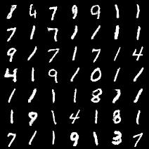
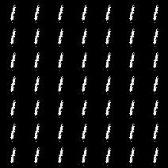

# Generative Adversarial Networks (GAN)
* Reproduction of <b><i><a href="https://arxiv.org/abs/1406.2661">\<Generative Adversarial Networks\></a></i></b> with PyTorch

# Settings
```
conda create -n gan python=3.12
conda activate gan
pip install -r requirements.txt

# Train
python train.py --config=gan.mnist.adam

# Generate
python subtasks/01_generate/exec.py -o adam
python subtasks/03_grid_generate/exec.py -o adam
```
# Results
<table align="center">
  <tr>
    <td align="center">
      <br>
      <em>(a) Optimizer: Adam</em>
    </td>
    <td align="center">
      <br>
      <em>(b) Optimizer: SGD <b>(Mode Collapse)</b></em>
    </td>
  </tr>
</table>

# References
* Repository
    
    1. https://github.com/goodfeli/adversarial
    2. https://github.com/eriklindernoren/PyTorch-GAN

```
@article{goodfellow2014generative,
  title={Generative adversarial nets},
  author={Goodfellow, Ian J and Pouget-Abadie, Jean and Mirza, Mehdi and Xu, Bing and Warde-Farley, David and Ozair, Sherjil and Courville, Aaron and Bengio, Yoshua},
  journal={Advances in neural information processing systems},
  volume={27},
  year={2014}
}
```